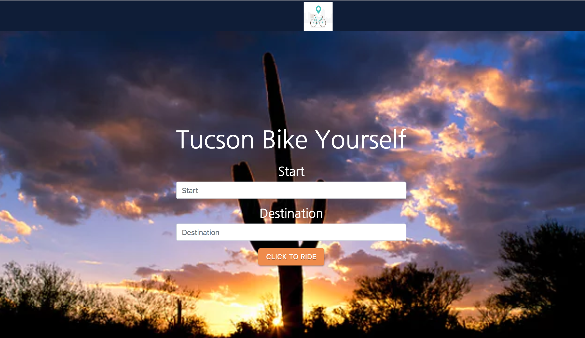
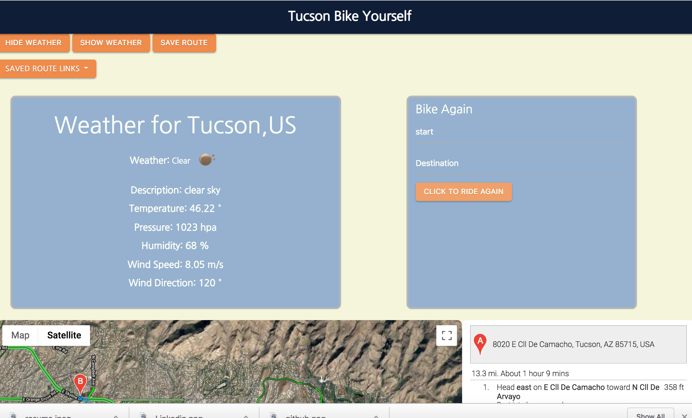

# project1_betaB

## URL

https://ac5599656.github.io/project1_betaB/

## Screenshots

### Landing Page

### Result Page

## Summary

The project1_betaB app allows users to search for bike routes in Tucson.  
Users can input the start and ending locations.  Once the users click 
the search button, the landing page disappears and the map of the search 
appears with the bike route and weather.  The map also indicates traffic and 
dedicated bike routes and lanes.  The save route feature allowsusers to save 
current bike route.  

## Technology Used

HTML/CSS/JavaScript/jQuery